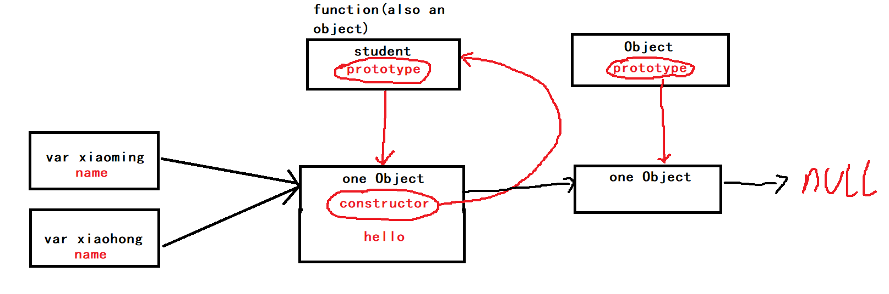

# JavaScript笔记-面向对象编程

​	JavaScipt不区分类和实例，所有的对象都是由一个已有实例（**原型**）来创建的。

​	直接看**class**继承吧，前面老语法又难又没用。

<!--more-->

## 创建对象

```html
<!DOCTYPE html>
<html lang="en">
<head>
    <meta charset="UTF-8">
    <title>面向对象编程</title>
</head>
<body>
<script>

    /*创建对象的方式*/

    /*1.Object.create()*/
    var me={
        name:'Sang',
        age:20,
        welcome:function () {
            console.log(this.name+'你好！')
        }
    };

    var you=Object.create(me);//Object.create(obj) 以obj为原型创建一个对象
    you.name='Wang';//新对象赋新值
    you.welcome();//Wang你好！

    /*每一个对象有一个原型链，访问对象属性/方法会沿着链向上查找，查找不到才返回undefined*/

    /*2.用new costructor函数*/
    function Man(height){
        this.height=height;//属性赋值
        this.speak=function(){//方法定义
            console.log(`I am a ${this.height} cm tall man`);
        }
    }//用new调用自动返回this

    var superMan=new Man('250');//新构建的对象的this指向superMan
    superMan.speak();//I am a 250 cm tall man

    /*superMan.constructor来自Man.prototype，指向Man函数*/
    console.log(superMan.constructor===Man);//true
    console.log(Man.prototype.constructor===Man);//true
    console.log(superMan.constructor===Man.prototype.constructor);//true
    console.log(superMan instanceof Man);//true

    console.log(Man.prototype);//Object
    console.log(Object.prototype);//Object
    console.log(Object.getPrototypeOf(superMan)===Man.prototype);//true

    /*如果用Man创建多个对象，那么这些对象均对应一个speak函数，其实它们共享一个speak函数就行了*/
    function Student(name){
        this.name=name;
    }

    Student.prototype.hello=function(){
        alert('Hello, ',this.name+'!');
    };

    var xiaohong=new Student('xiaohong');
    var xiaoming=new Student('xiaoming');
    //这样xiaohong.hello和xiaoming.hello共享一份hello函数
	//参考底下的原型链示意图
    
    
    /*一个更优秀的创建方式*/
    function Person(props) {
        this.name=props.name||'匿名';//默认值为匿名
        this.garde=props.grade||1;//默认值为1
    }

    Person.prototype.hello=function(){
        alert('Hello, '+this.name+'!');
    }

    function createPerson(props){
        return new Person(props||{});//||{}表示默认情况
    }

    var xiaogang=createPerson({name:'xiaogang'});
    console.log(xiaogang.garde);//1
</script>
</body>
</html>
```



## 原型继承

​	这个太复杂还用不到，不学了

## class继承

​	这个语法很舒服啊，比上面的舒服多了，直接看这个。

​	唯一缺点是语法太新，有些浏览器不支持这种写法。但是可以用https://babeljs.io/这个工具转换成原始的代码。

```javascript
class Student{
	constructor(name){
        this.name=name;
    }
    
    hello(){
        alert('Hello, '+this.name+'!');
    }
}

class PrimaryStudent extends Student{
    constructor(name,grade){
        super(name);
        this.grade=grade;
    }
    
    myGrade(){
        alert('I am at grade '+this.grade);
    }
}
```

​	语法和Java出奇地相似啊！

