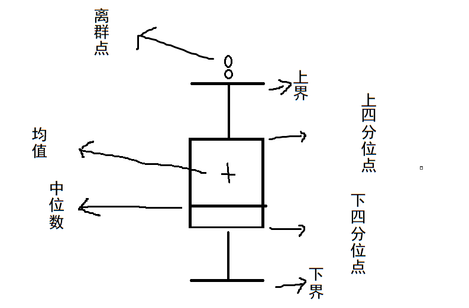
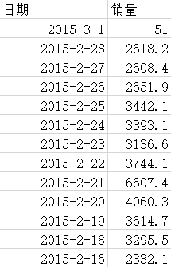
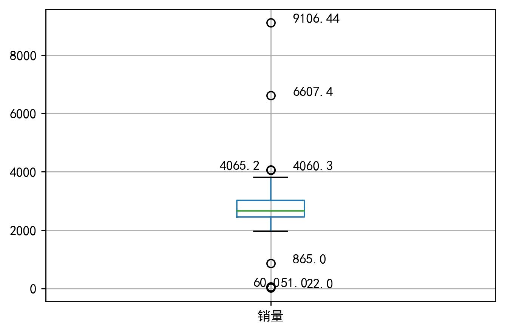
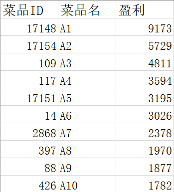
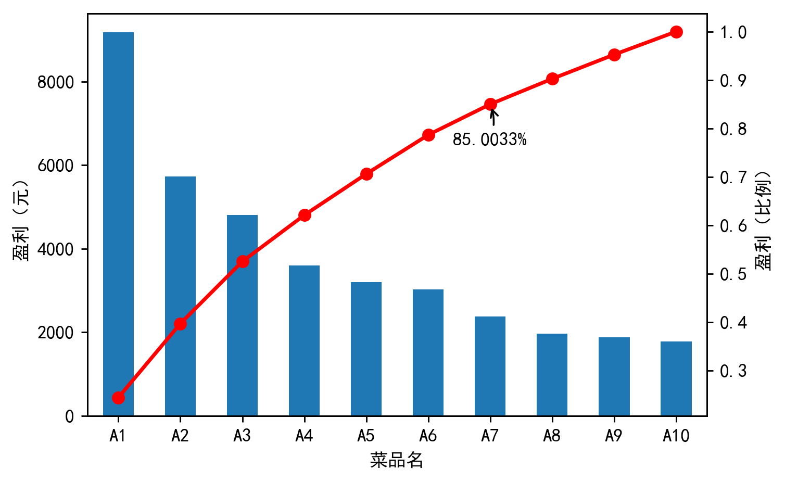
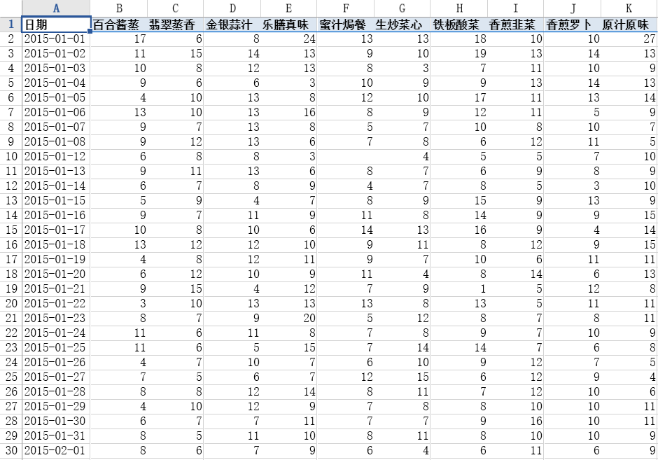

## 数据质量分析

​	为数据预处理的前提，主要是检查**脏数据**：

+ 缺失值
+ 异常值
+ 不一致的值
+ 重复数据及含有特殊符号的数据

<!--more-->

### 缺失值分析

​	两种情况：①记录缺失	②记录中的某些字段缺失

​	缺失分析：缺失值的属性个数，每个属性的未缺失数、缺失数和缺失率。

### 异常值分析

#### 简单统计量分析

​	一般设定统计量的最大值、最小值，看是否不在区间内。

#### $3\sigma$原则

​	数据符合**正态分布**，异常值为**与平均值的偏差超过3倍标准差**的值。($P(|x-\mu|>3\sigma)\le0.003$)。

#### 盒图分析

​	$Q_L: 下四分位数$

​	$Q_U: 上四分位数$

​	$IQR: 四分位数间距$

​	$异常值： <Q_L-1.5IQR || >Q_L+1.5IQR$

​	



```python
# -*- coding: utf-8 -*-
"""
Created on Sun May  3 11:31:50 2020

@author: SANG
"""


import pandas as pd
import matplotlib.pyplot as plt

catering_sale='data/catering_sale.xls' #餐饮数据
data=pd.read_excel(catering_sale,index_col=u'日期')#读取数据，指定"日期"列为索引列

plt.rcParams['font.sans-serif']=['SimHei']#用于正常显示中文标签
plt.rcParams['axes.unicode_minus']=False#用于正常显示负号

plt.figure(dpi=256)#建立图像
p=data.boxplot(return_type='dict')#画箱图，使用的是DataFrame的方法
x=p['fliers'][0].get_xdata() #'fliers'为异常值的标签
y=p['fliers'][0].get_ydata()
y.sort()#从小到大排序，该方法直接改变原对象

#用annotate添加注释

for i in range(len(x)):
    if i>0:
        plt.annotate(y[i],xy=(x[i],y[i]),xytext=(x[i]+0.05-0.8/(y[i]-y[i-1]),y[i]))
    else:
        plt.annotate(y[i],xy=(x[i],y[i]),xytext=(x[i]+0.08,y[i]))
        
plt.show()
```



### 一致性分析

​	一般是数据更新不一致，导致数据之间的矛盾。

## 数据特征分析

### 分布分析

#### 频率分布分析

1. 求极差（最大值-最小值）
2. 决定组距和组数（组数=极差/组距）
3. 决定分点（把数据划分成若干区间的点）
4. 绘制频率分布直方图

### 对比分析

	+ 绝对数比较
	+ 相对数比较

### 统计量分析

#### 集中趋势度量

1. 均值
2. 中位数
3. 众数

#### 离散趋势度量

1. 极差
2. 标准差$s=\sqrt{\frac{\sum(x_i-\bar{x})^2}{n}}$
3. 变异系数$CV=\frac{s}{\bar{x}}$
4. 四分位数间距=上四分位数$Q_U$-下四分位数$Q_L$

---

还是分析上面的餐饮数据，这次分析其**统计量**。

```python
# -*- coding: utf-8 -*-
"""
Created on Sun May  3 15:33:04 2020

@author: SANG
"""


import pandas as pd

catering_sale='data/catering_sale.xls'#餐饮数据
data=pd.read_excel(catering_sale,index_col=u'日期')#读取数据，指定"日期"列为索引列
data=data[(data[u'销量']>400)&(data[u'销量']<5000)]#过滤异常数据
statistics=data.describe()#保存基本的统计量

statistics.loc['range']=statistics.loc['max']-statistics.loc['min']#极差
statistics.loc['var']=statistics.loc['std']/statistics.loc['mean']#变异系数
statistics.loc['dis']=statistics.loc['75%']-statistics.loc['25%']#四分位数间距

print(statistics)

```

```python
                销量
count   195.000000
mean   2744.595385
std     424.739407
min     865.000000
25%    2460.600000
50%    2655.900000
75%    3023.200000
max    4065.200000
range  3200.200000
var       0.154755
dis     562.600000
```

---

### 贡献度分析

​	即**帕累托分析**。大概类似于看哪20%数据（或者更多更少）贡献了80%。

---



```python
# -*- coding: utf-8 -*-
"""
Created on Sun May  3 15:50:30 2020

@author: SANG
"""


import pandas as pd
import matplotlib.pyplot as plt

dish_profit='data/catering_dish_profit.xls'
data=pd.read_excel(dish_profit,index_col=u'菜品名')
data=data[u'盈利'].copy()
data.sort_values(ascending=False)

plt.rcParams['font.sans-serif']=['SimHei']
plt.rcParams['axes.unicode_minus']=False

plt.figure(dpi=256)
data.plot(kind='bar')#条形图
plt.ylabel(u'盈利（元）')
p=1.0*data.cumsum()/data.sum()
p.plot(color='r',secondary_y=True,style='-o',linewidth=2)
plt.annotate(format(p[6],'.4%'),
             xy=(6,p[6]),
             xytext=(6*0.9,p[6]*0.9),
             arrowprops=dict(arrowstyle='->',connectionstyle='arc3,rad=.2'))

plt.ylabel(u'盈利（比例）')
plt.show()
```



---

### 相关性分析

+ 两个变量，绘制散点图
+ 多个变量，绘制散点图矩阵
+ 计算相关系数
+ 1. Pearson相关系数（数据服从正态分布）
  2. Spearman相关系数
  3. 判定系数（相关系数的平方）

---



```python
# -*- coding: utf-8 -*-
"""
Created on Wed May  6 09:42:25 2020

@author: SANG
"""


import pandas as pd

catering_sale='data/catering_sale_all.xls'
data=pd.read_excel(catering_sale, index_col=u'日期')

print(data.corr())#给出任意两款菜式之间的相关系数矩阵
print(data.corr()[u'百合酱蒸凤爪'])#只显示"百合酱蒸凤爪"与其他菜式的相关系数
print(data[u'百合酱蒸凤爪'].corr(data[u'翡翠蒸香茜饺']))


```


---