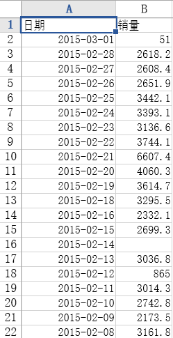
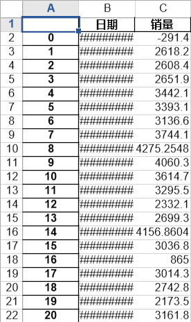
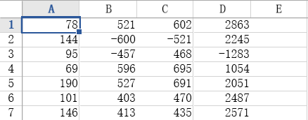
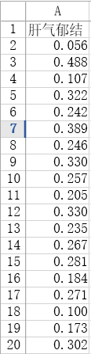
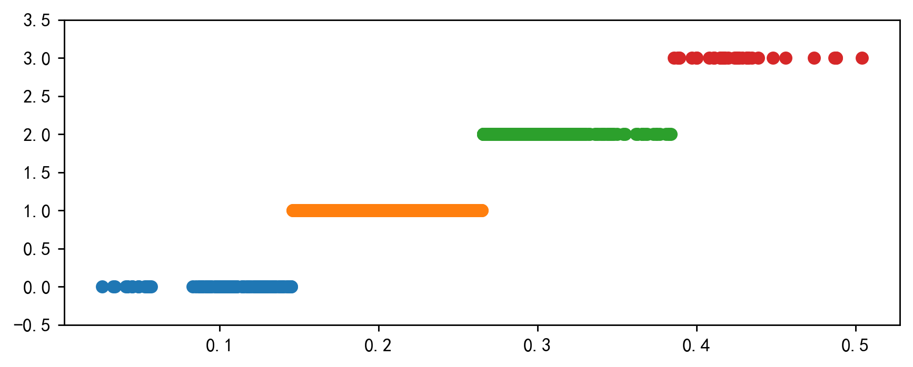
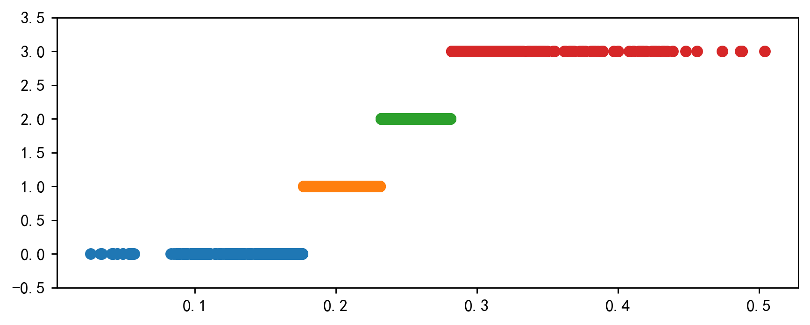
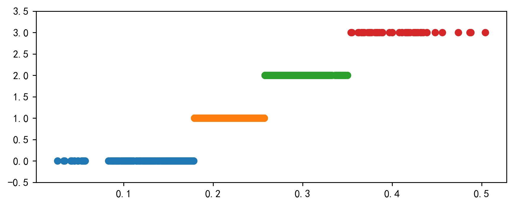
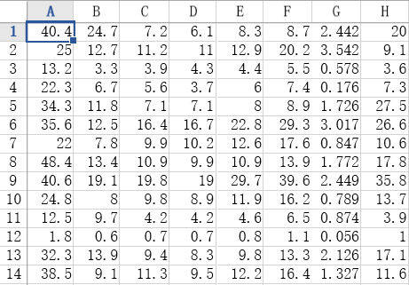
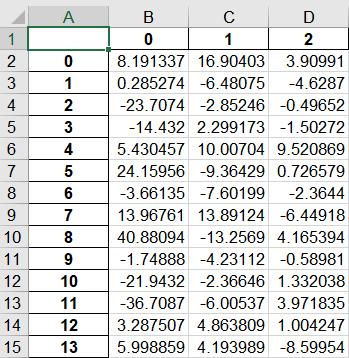

# 数据预处理

## 数据清洗

### 缺失值处理

#### 处理方法

+ 删除
+ 数据插补
+ 不处理

#### 数据插补方法

| 插补方法             | 描述                                                         |
| -------------------- | ------------------------------------------------------------ |
| 均值/中位数/众数替代 |                                                              |
| 最邻近插补           | 用与缺失值最接近的样本的该属性值来插补                       |
| 回归函数             | 用其他变量拟合缺失变量，预测其值                             |
| 插值函数             | 拉格朗日插值（有新的值进来，插值函数会改变，但用python实现简单），牛顿插值（解决了拉插的缺点） |
| 使用固定值           |                                                              |

<!--more-->

---



```python
# -*- coding: utf-8 -*-
"""
Created on Wed May  6 10:32:34 2020

@author: SANG
"""


#拉格朗日插值
import pandas as pd
from scipy.interpolate import lagrange#导入拉格朗日插值函数

inputfile='data/catering_sale.xls'#销售数据路径
outputfile='temp/sales.xls'#输出数据路径

data=pd.read_excel(inputfile)#读入数据
data[u'销量'][(data[u'销量']<400)|(data[u'销量']>5000)]=None#过滤异常值，使其变成空值

#自定义列向量插值函数
#s为列向量（传入的是Series类型），n为被插值的位置，k为取前后的数据个数，默认为5
def polyinterp_column(s,n,k=5):
    y=s.reindex(list(range(n-k,n))+list(range(n+1,n+1+k)))#取数，[1,2]+[3,4]=[1,2,3,4]，这里是按照索引取Series里的值
    y=y[y.notnull()]#剔除空值
    return lagrange(y.index,list(y))(n)#插值并返回插值结果

print(data.columns)

#逐个元素判断是否需要插值
for i in data.columns:
    for j in range(len(data)):
        if (data[i].isnull())[j]:#如果为空即插值
            data[i][j]=polyinterp_column(data[i],j)
                
data.to_excel(outputfile)#输出结果，写入文件
```



---

## 数据集成

​	将分布在不同地方的数据集成。

### 实体识别

+ 同名异义
+ 异名同义
+ 单位不统一

### 冗余属性识别

+ 同一属性多次出现
+ 同一属性命名不一致

## 数据变换

### 简单函数变换

​	就是用简单函数处理一下原数据

### 规范化

​	消除数据之间**量纲**和**取值范围**差异带来的影响

#### 最小-最大规范化

​	$x^*=\frac{x-min}{max-min}$

>
>
>缺点：
>
>+ 将来有在[max,min]范围之外的数据加了进来，[max,min]就变了，需要重新算
>+ 数据数值很大而且集中，规范化后各值接近0，而且相差不大

#### 零-均值规范化

​	$x^*=\frac{x-\bar{x}}{\sigma}$

​	$\sigma为标准差$

​	处理后数据均值为0，标准差为1

>
>
>目前最多用这种规范化方法

#### 小数定标规范化

​	**将小数映射到[-1,1]之间**

​	$x^*=\frac{x}{10^k}$

---



```python
# -*- coding: utf-8 -*-
"""
Created on Wed May  6 12:43:30 2020

@author: SANG
"""


import pandas as pd
import numpy as np

datafile='data/normalization_data.xls'

data=pd.read_excel(datafile,header=None)

print((data-data.min())/(data.max()-data.min()))#最小-最大化规范
print((data-data.mean()/data.std()))#零-均值规范化
print(data/10**np.ceil(np.log10(data.abs().max())))#小数定标规范化
```


```python
          0         1         2         3
0  0.074380  0.937291  0.923520  1.000000
1  0.619835  0.000000  0.000000  0.850941
2  0.214876  0.119565  0.813322  0.000000
3  0.000000  1.000000  1.000000  0.563676
4  1.000000  0.942308  0.996711  0.804149
5  0.264463  0.838629  0.814967  0.909310
6  0.636364  0.846990  0.786184  0.929571
            0           1           2            3
0   75.309998  520.602444  601.039834  2861.811846
1  141.309998 -600.397556 -521.960166  2243.811846
2   92.309998 -457.397556  467.039834 -1284.188154
3   66.309998  595.602444  694.039834  1052.811846
4  187.309998  526.602444  690.039834  2049.811846
5   98.309998  402.602444  469.039834  2485.811846
6  143.309998  412.602444  434.039834  2569.811846
       0      1      2       3
0  0.078  0.521  0.602  0.2863
1  0.144 -0.600 -0.521  0.2245
2  0.095 -0.457  0.468 -0.1283
3  0.069  0.596  0.695  0.1054
4  0.190  0.527  0.691  0.2051
5  0.101  0.403  0.470  0.2487
6  0.146  0.413  0.435  0.2571
```


---

### 连续属性离散化

#### 等宽法

​	将数据的取值域划分为若干**等宽区间**

> 缺点：离群点对区间划分影响很大

#### 等频法

​	每个区间拥有**相同的数据量**

> 缺点：为了满足等频，相同属性值的数据可能被划分到不同的区间内

#### 基于聚类分析的方法

​	确定簇的个数，进行聚类，同一簇的属性值使用同一个标记

---



---

```python
# -*- coding: utf-8 -*-
"""
Created on Wed May  6 15:41:09 2020

@author: SANG
"""


#数据离散化
import pandas as pd

datafile='data/discretization_data.xls'
data=pd.read_excel(datafile)
data=data[u'肝气郁结证型系数'].copy()
k=4

#等宽离散化
d1=pd.cut(data,k,labels=range(k))#分4个区间，标签分别为0,1,2,3

#等频率离散化
w=[1.0*i/k for i in range(k+1)]
w=data.describe(percentiles=w)[4:4+k+1]#使用describe函数自动计算分位数
w[0]=w[0]*(1-1e-10)
d2=pd.cut(data,w,labels=range(k))

#聚类分析的方法
from sklearn.cluster import KMeans#引入KMeans
kmodel=KMeans(n_clusters=k,n_jobs=4)#建立模型，分为4个簇，n_jobs是CPU数
kmodel.fit(data.to_numpy().reshape((len(data),1)))#训练模型
c=pd.DataFrame(kmodel.cluster_centers_).sort_values(0)#输出聚类中心并排序
w=c.rolling(2).mean().iloc[1:]#相邻两项求中点，作为边界点
w=[0]+list(w[0])+[data.max()]#加上首末边界点
d3=pd.cut(data,w,labels=range(k))

#自定义作图函数来显示聚类结果
def cluster_plot(d,k):
    import matplotlib.pyplot as plt
    plt.rcParams['font.sans-serif']=['SimHei']
    plt.rcParams['axes.unicode_minus']=False
    
    plt.figure(figsize=(8,3),dpi=256)
    for j in range(0,k):
        plt.plot(data[d==j],[j for i in d[d==j]],'o')
        
    plt.ylim(-0.5,k-0.5)
    return plt

cluster_plot(d1,k).show()
cluster_plot(d2,k).show()
cluster_plot(d3,k).show()

```

>
>
>https://pandas.pydata.org/docs/reference/api/pandas.cut.html?highlight=cut#pandas.cut
>
>https://pandas.pydata.org/docs/reference/api/pandas.DataFrame.sort_values.html?highlight=sort_values#pandas.DataFrame.sort_values
>https://pandas.pydata.org/docs/reference/api/pandas.DataFrame.iloc.html?highlight=iloc#pandas.DataFrame.iloc







### 属性构造

​	用已有属性集构造出新的属性

### 小波变换

​	一种信号分析手段

## 数据规约

> 意义：
>
> + 少数有代表性的数据，缩短数据挖掘时间
> + 少占用存储空间
> + 降低无效、错误数据对建模的影响，提高建模准确性

### 属性规约

#### 主成分分析

​	用组合的几个新变量，代替原来所有变量对数据的解释

---



```python
# -*- coding: utf-8 -*-
"""
Created on Sat May  9 19:48:28 2020

@author: SANG
"""


import pandas as pd

#参数初始化
inputfile='data/principal_component.xls'
outputfile='temp/dimention_reducted.xls'#降维后的数据

data=pd.read_excel(inputfile,header=None)#读入数据

from sklearn.decomposition import PCA

pca=PCA(3)#PCA(n_components=None,copy=True,whiten=False)
#n_components为主成分个数，copy为是否新建数据来执行PCA，否则会修改原始数据
#whiten为是否白化
pca.fit(data)
low_d=pca.transform(data)#降维
pd.DataFrame(low_d).to_excel(outputfile)
#pca.inverse_transform(low_d)#复原成原数据
print(pca.components_)#返回模型的各个特征向量
print(pca.explained_variance_ratio_)#返回各个成分各自的方差百分比


```




---

### 数据规约

​	用较少的数据代替原数据

#### 直方图

​	无非是把数据的区间选大点，这样数据量就少了

#### 聚类

​	将数据元组划为不同的簇，实现数据规约

#### 抽样

+ 简单随机抽样
+ 聚类抽样
+ 分层抽样

#### 参数回归

​	参数回归模型有了，那有了模型就直接代表了数据

## Python数据预处理函数

| 函数名  |       功能       |    所属库    |
| :-----: | :--------------: | :----------: |
| unique  |     数据插值     |    Scipy     |
| unique  | 去除数据重复元素 | Pandas/Numpy |
| isnull  |  判断是否为空值  |    Pandas    |
| notnull |  判断是否非空值  |    Pandas    |
|   PCA   |    主成分分析    | Scikit-Learn |
| random  |   生成随机矩阵   |    Numpy     |

